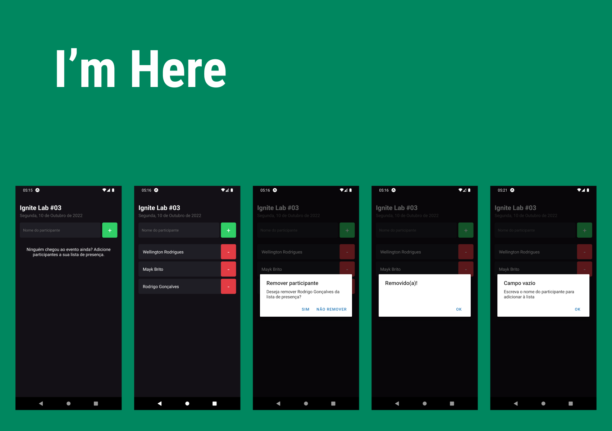

<h1 align="center">
  
</h1>

# Sobre o projeto

<p>
  Projeto desenvolvido para aprender os fundamentos do React Native com TypeScript e Expo Managed workflow.
</p>

# Tecnologias

- [React Native](https://reactnative.dev/)
- [TypeScript](https://www.typescriptlang.org/)
- [Expo](https://expo.dev/)

## Como baixar o projeto

```bash
# Clonar o repositório
$ git clone https://github.com/wellingtonrodriguesbr/imhere.git

# Entrar no diretório
$ cd imhere


# Instalar as dependências
$ npm install

# Rodar o projeto
$ expo start
```

<br/>
<hr/>

<p align="center">Desenvolvido por <a href="https://www.linkedin.com/in/wellingtonrodriguesbr/" target="_blank">Wellington Rodrigues</a> ✌🏽</p>
